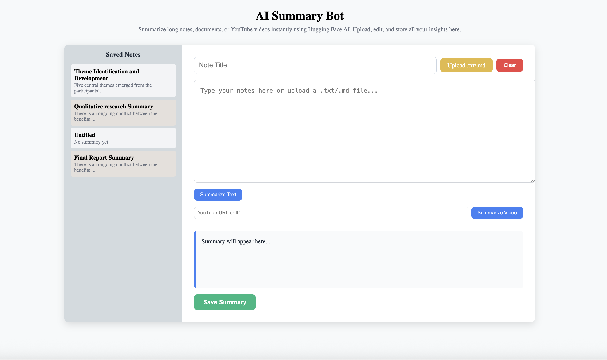
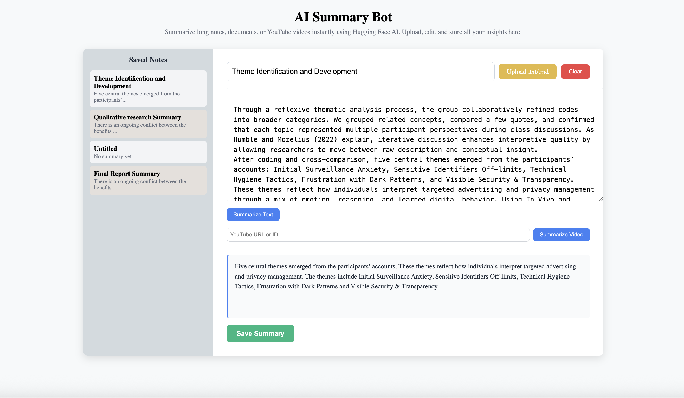

#  AI Summary Bot

An AI notes and YouTube summarization tool built with **React**, **Flask**, **PostgreSQL**, and the **Hugging Face API**.  
It allows users to upload text files, summarize text or YouTube videos, and save summaries for later use , all through a clean, responsive interface.

---

##  Features

- **Text Summarization** — Instantly summarize long text content.
-  **File Upload Support** — Upload `.txt` or `.md` files to auto-fill the text field.
-  **YouTube Video Summarization** — Paste a YouTube URL to generate summaries using its transcript.
- **Save & Retrieve Summaries** — Store and fetch summaries using PostgreSQL.
-  **AI-Powered** — Uses Hugging Face transformer models for accurate summaries.
- **Modern UI** — Clean, border-boxed interface styled with React.

---

## 🧩 Tech Stack

| Frontend | Backend | Database | AI Model |
|-----------|----------|-----------|-----------|
| React.js | Flask (Python) | PostgreSQL | Hugging Face Transformers |

---

### 🏠 Home/Upload Screen

### 📂 Summarize

### 💾 Saved Summaries

